# FitPets (uOttaHack 2021)

## Elevator Pitch
With the pandemic keeping us at home, exercise is extremely important for both our physical and mental health. With the help of our FitPets, you'll have a portable pet cheering you on everyday!

## About the project
### Inspiration
We were inspired by the health tracking functionality that FitBit gives their users and the nostalgia that the Tamagotchi virtual pets give their users. We wanted to mix the nostalgia with something new to create a fun way to motivate users to keep up with their daily steps.
### What it does
Visit and take care of one of ten virtual pets as they help you reach your daily goals.
Each day you will be visited by a new pet; take care of them by feeding and playing and making sure their hunger and happiness meters are satisfied. To feed, achieve a certain amount of steps to get food for your pet and increase the hunger meter. Play with your pet by selecting the play button, which will increase the happiness meter. Be careful not to let your happiness or hunger meter get too low, or your pet will get sick! Remember, pets get tired too and need to sleep, so make sure you keep up your steps!

### How we built it
We created the pixel art for all of the FitPets using Pixilart and Piskel. We created the functionality using FitBit Studio (SVG, CSS3, JavaScript).

### Challenges we ran into
We came across various limitations with our selected platform. Fitbit Studio does not allow applications to run while the app is not open. To resolve this issue we kept track of the time since the app was last opened by the user. In addition, Fitbit Studio offers a limited range of designs for buttons. Due to this, we had to alter our initial designs to work with the limitations.

### Accomplishments that we're proud of
We learned how to use Fitbit Studio within 36 hours wihtout any prior experience. Also, we are proud of the amazing work of our designer!

### What we learned
We learned how to coordinate with a team and successfully divide tasks, and coordinate ideas with a team of developers and non-developers. We gained experience with methods used to thoroughly test code as well as merging code between different developers. In addition, we learned our way around Fitbit Studio, which helped us adapt to working in a brand new, fast-paced environment.

### What's next for FitPet
Features we would like to add in the future would be the ability to keep the food earned from your steps the previous day when the pet is changed at midnight. 
We would like to add a currency system and the ability to select what type of food to purchase for your pet. Instead of earning food from your steps, you would earn currency. We would like for pets to be around for longer than a day, as well as adding more pets to add variety to the application. Ideally in the future, the happiness meter would be filled up by reaching your daily goals in order to motivate the users to reach their goals. We would also like some animals to be more rare than others.

## Built with
Fitbit Studio (SVG, CSS3, JavaScript), Pixilart, Piskel

## Try it out
To download on computer:
1. Create an account on Fitbit Studio using your Fitbit login.
2. Open Fitbit Studio and create a new project of type Empty Canvas.
3. Select the simulator tab on the top and download Fitbit OS Simulator.
4. Open Fitbit OS Simulator and go to settings. Change the device type to Sense.
5. Download GitHub project.
6. Drag and drop projects contents into your Fitbit Studio project. (Make sure the entire project is not contained in a folder. Each folder should be entered separately.)
7. Connect your Fitbit OS Simulator and then run.

## Project Demo
TBD

## Meet the pets!

### Mochi

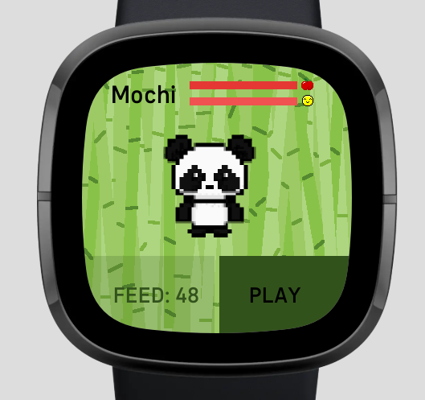

### Maple

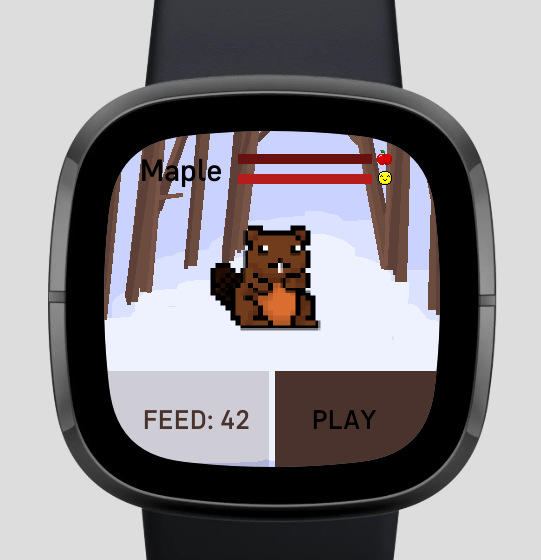

### Drago

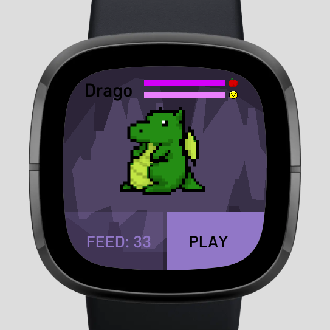

### Oscar

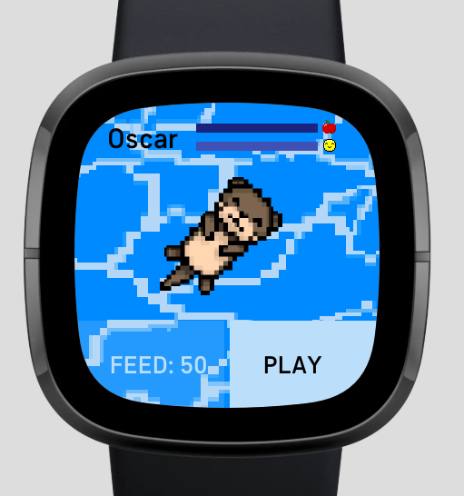

### Skipp
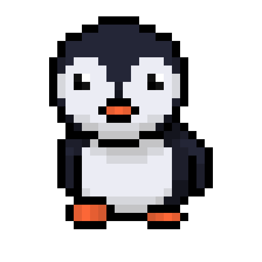
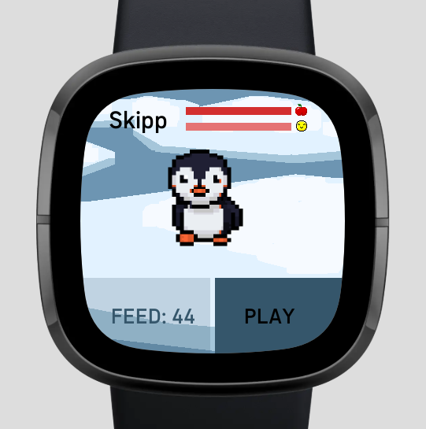

### Chad

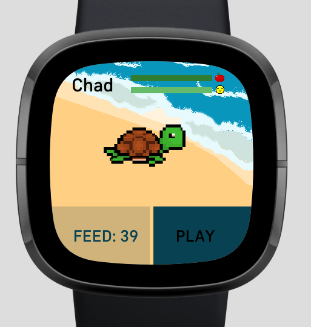

### Fiona

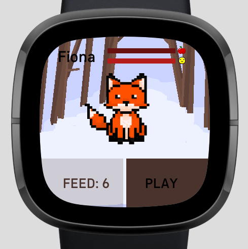

### Blubb

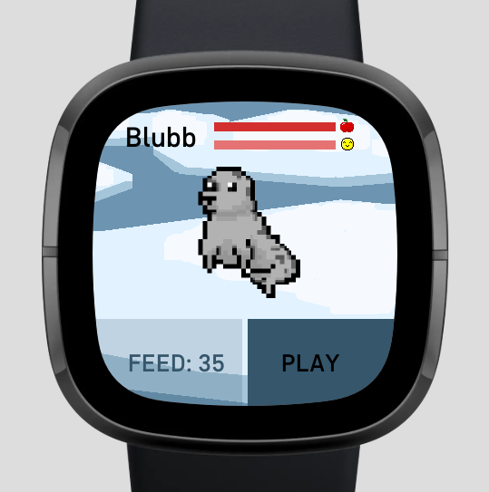

### Shade

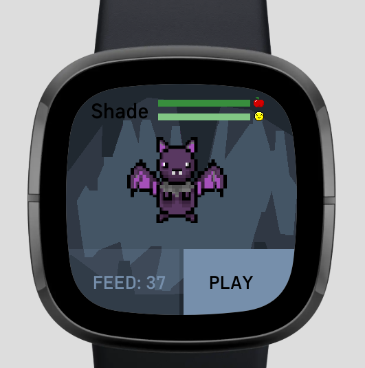

### Bonzo
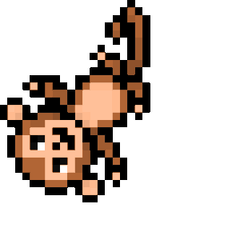

# Pet Animations (we used Fiona for this example)
### Default

### Sleep
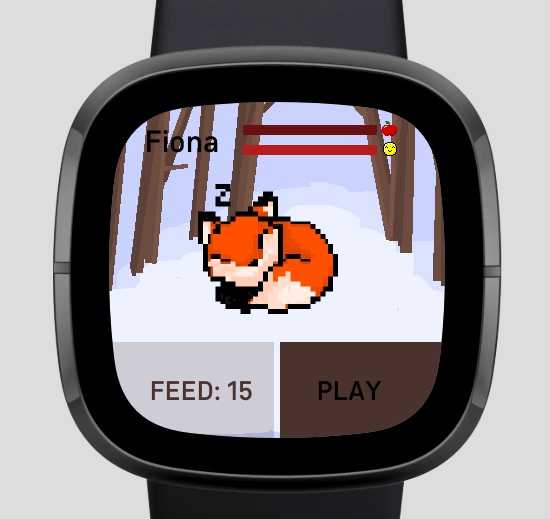

### Sick
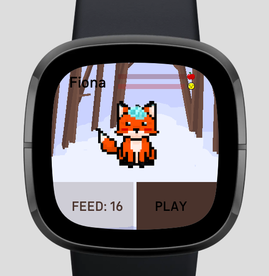

### Play
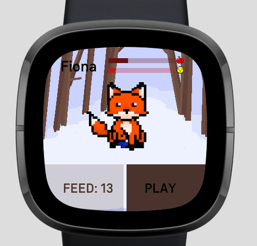

### Eat
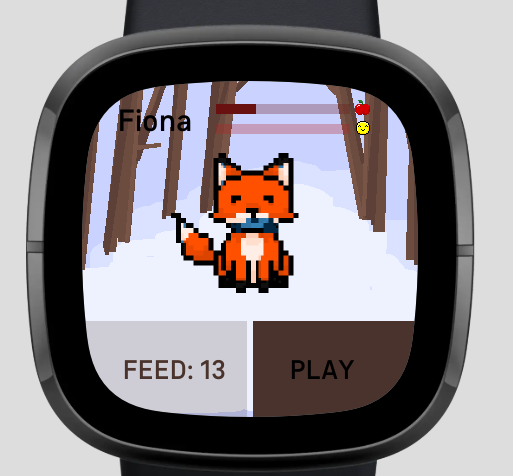

## Developers
Michelle Paradis, Rishaad Quaiser, Sydney Morrow

## Artist/Designer
Alysa Levy
